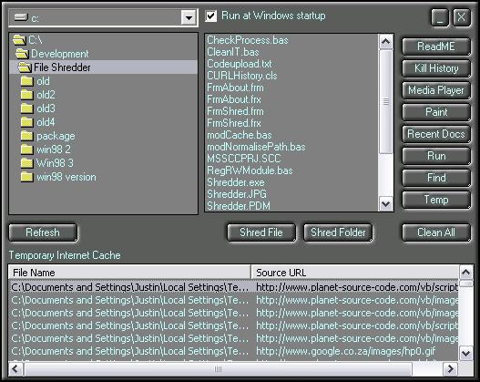



## A File Shredder \- History Eraser \- Privacy cleaner  with Auto Kill

### Description

Updated. Shreds files. Kills Internet explorer history, cookies, temp internet files. Now has AUTO KILL feature which will kill history when last instance of internet explorer is closed. Cleans INDEX.DAT files on your computer which also keep tracks of your activities. With this project you can learn the use of classes, file system object, API, putting an icon in the system tray, getting a process from the task manager and more. Also cleans paint, media, temp folder, recent docs etc.
 
### More Info
 

             |
---                |---
**Submitted On**   |2005-04-07 11:11:00
**By**             |[Justin Yates](https://github.com/Planet-Source-Code/PSCIndex/blob/master/ByAuthor/justin-yates.md)
**Level**          |Intermediate
**User Rating**    |4.9 (117 globes from 24 users)
**Compatibility**  |VB 6\.0
**Category**       |[Complete Applications](https://github.com/Planet-Source-Code/PSCIndex/blob/master/ByCategory/complete-applications__1-27.md)
**World**          |[Visual Basic](https://github.com/Planet-Source-Code/PSCIndex/blob/master/ByWorld/visual-basic.md)
**Archive File**   |[A\_File\_Shr187324472005\.zip](https://github.com/Planet-Source-Code/justin-yates-a-file-shredder-history-eraser-privacy-cleaner-with-auto-kill__1-49643/archive/master.zip)

